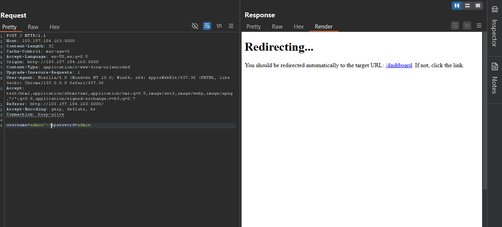
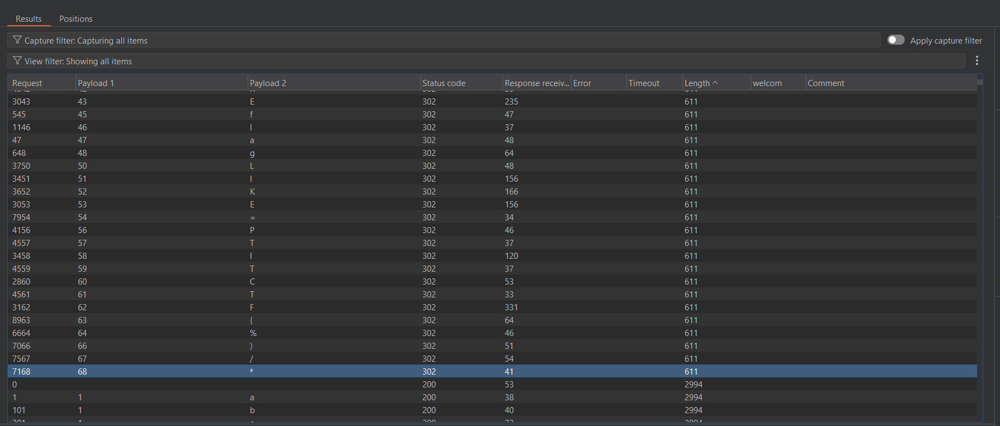
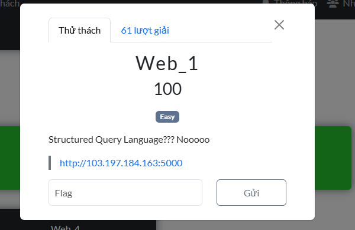
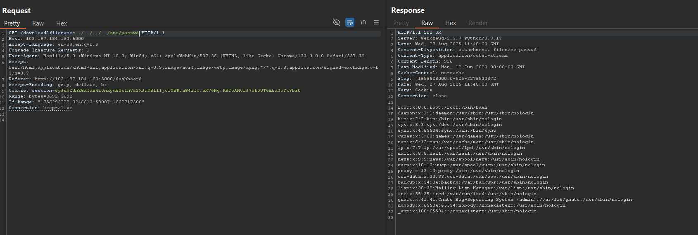
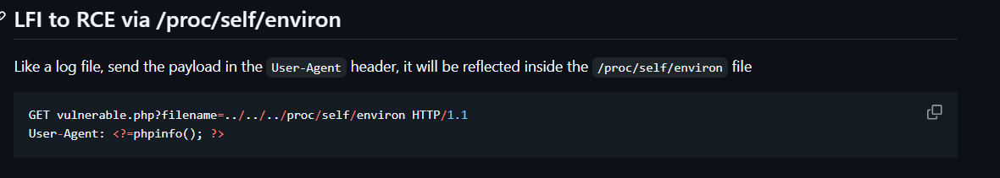
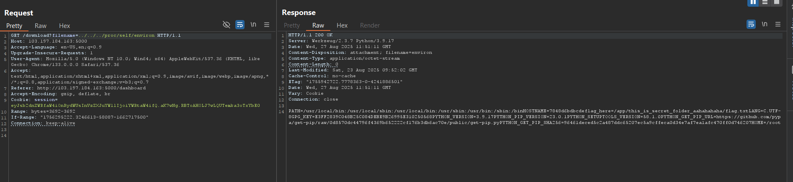
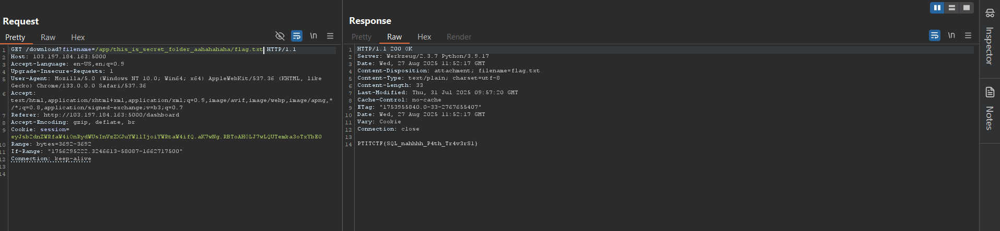

Với thử thách này thì ban đầu mình cứ tưởng nó là SQL injection lý do là khi mình thử payload này:

Và mình tiếp tục kiểm thử theo dạng SQLite để mong rằng tìm được flag trong một bảng nào đó nhưng sao
một quá trình dò bảng thì mình nhận được một bảng có tên là users và có ba cột id , username, password
-Mình quyết định là tìm xem thử ở các giá trị ở 3 cột này thì đúng thật có cột chứ 'PTITCTF{' nhưng khi mình dò ra thì:
 
- Ok vậy mình mất khá nhiều thời gian cho việc này, nhưng sao một hồi bạn mình nhắc nhở thì mình nghĩ đã sai từ đầu và mình
phát hiện để bài nói là : 
Thì chắc là ko phải là SQL rồi
- Mình có để ý một chức năng download thì nó sẽ gọi đến API này: http://103.197.184.163:5000/download?filename=Screenshot_2025-08-27_184311.png
- Vậy thì sẽ test file inclusion :

-Vậy là chính nó từ đây mình có thể test xem những lổ hổng liên quan chủ đề LFI hay RFI sau một hồi mò mẫm thì mình có dò những cái đường dẫn mà 
hệ điều hành linux thường có và nó là : 
Nó được giới thiệu như là một log-file nên mình sẽ test khứa này và bùm :

Nó chứa file flag mình cần tìm . Lấy cờ là nộp .

PTITCTF{SQL_nahhhh_P4th_Tr4v3rS1}