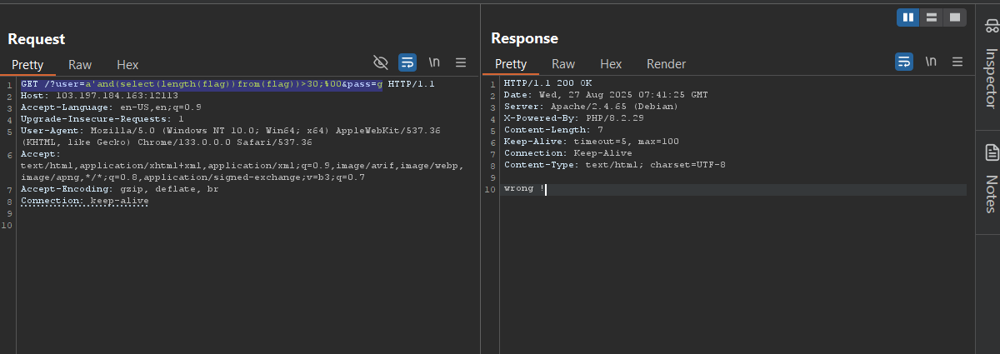
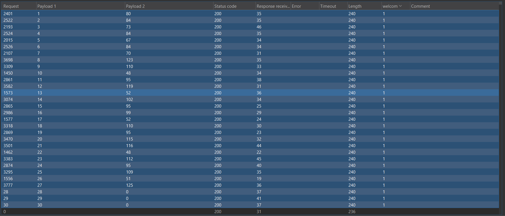

-Như vậy bắt buộc ta phải né những từ này ra trong 2 input này , ban đầu mình nghĩ đến ý tưởng là pass qua được đăng
nhập với payload như sau : GET /?user=a'||1=1;%00&pass=c HTTP/1.1
- Nhưng mà khi đọc code kỹ lại thì nó chỉ hiển thị môt là welcome hai là wrong ba là forbiden nếu trúng blacklist

Như vậy thì dạng này giống như Blind SQL hơn, mình đã tham khảo payload trong trang payloadAllTheThing để thử các
payload và ngoài ra còn tham khảo trang này:
https://websec.wordpress.com/2010/03/19/exploiting-hard-filtered-sql-injections/
- Mình thấy trang này chỉ ra những cú pháp cực kỳ hay để bypass những filter trong thực tế ví dụ thì bạn có thể xem thấy
ở trang web ấy
***Khai thác:
- Bên cạnh việc đoán tên bảng thì để nhanh chóng xem thực sự có cột mục tiêu trong bảng đó hay không thì mình dùng
payload sau: GET /?user=a'||(select(length(flag))from(flag))>30;%00&pass=g HTTP/1.1

- Như vậy ở đây ta có thể thấy là nó có phản ứng với độ dài của giá trị cột flag trong bảng flag luôn vậy nên ta khẳng định
chắc chắn rằng có cột flag trong bảng flag. Bước tiếp theo ta sẽ thực hiện việc dò độ dài của cột đó các bạn có thể dùng intruder
để quét nhưng ở đây mình dùng tìm kiếm nhị phân luôn cho nhanh : (Cụ thể là mình sẽ dò trc >30 nếu wrong thì sẽ dò >15 nếu true 
thì sẽ tiếp tục >20 rồi >25 không nếu true thì sẽ dò trong khoảng 25 đến 29 và mình nhận thấy độ dài là 27)

-Ok xác định được là độ dài là 27 thì ta bắt đầu dò từng ký tự trong giá trị flag :

Có thể nhìn thấy là do Mysql nó đều nhận chữ thường hay hoa ở mỗi vị trí đều dùng nên kiểu so sánh tùng ký tự này coi như thua, bắt buộc là phải tìm kiếm theo ký tự mã nhị phân , mình sẽ dùng một cái gọi là :VD  dùng ord(48) thì sẽ là số 0. Nên payload sẽ trở thành lại là :a'||(select(ord(concat(mid(flag,1,1))))from(flag))=80;%00

tổng hợp lại thì flag sẽ là : PTITCTF{n0_w4f_c4n_st0p_m33}