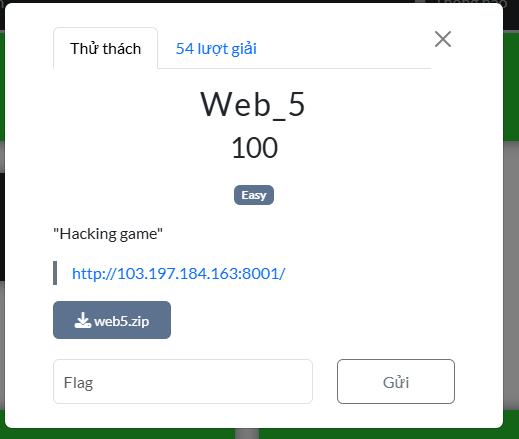
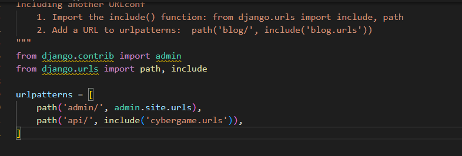
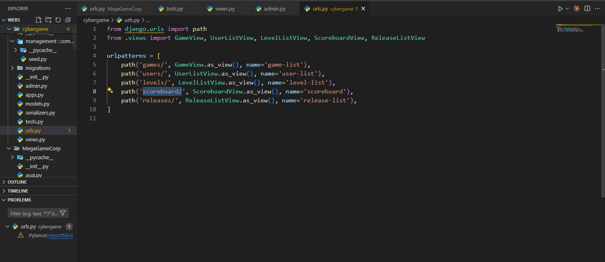
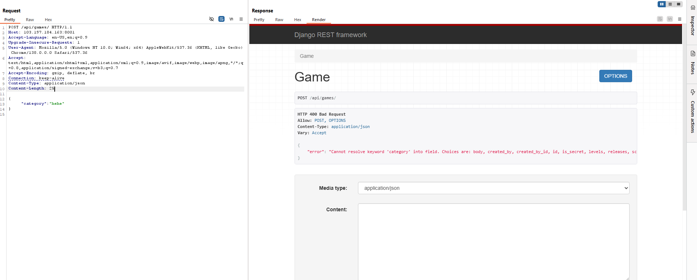
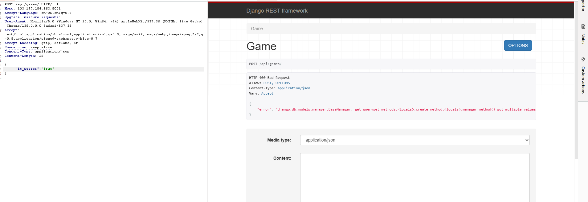
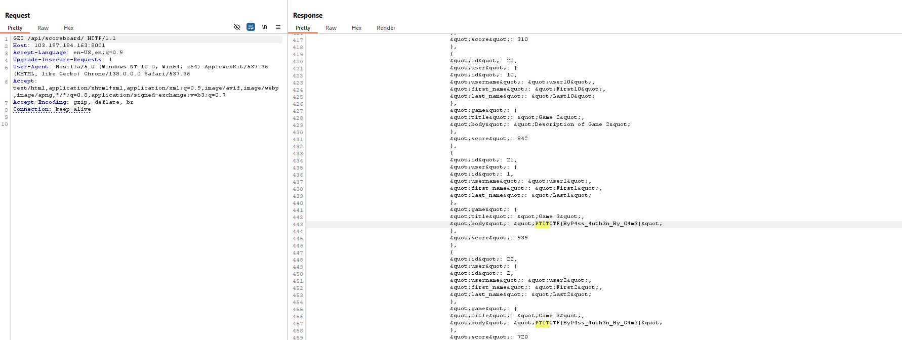

- Bài này thì liên quan đến việc đọc hiểu code :
+ Đầu tiên ta quan sát luồng chạy của ứng dụng trên file urls.py

Ở đây nó chứa những cái endpoint của trang web , đi vào từng endpoint và đọc code xem có xử lí
cái gì
- Nếu ở /api/games :
class GameView(APIView):
    def post(self, request: Request, format=None):
        try:
            games = Game.objects.filter(is_secret=False, **request.data)
            serializer = GameSerializer(games, many=True)
            return Response(serializer.data, status=status.HTTP_200_OK)
        except Exception as e:
            print(e)
            return Response({"error": str(e)}, status=status.HTTP_400_BAD_REQUEST)

- Ở đây người dùng có thể nhập vào data để lọc ra theo mục trong game ,và nó sẽ lấy trong database hiển thị 
lên lại các game theo điều kiện lọc, nhưng mà ở đây mình chú ý là nó lấy mấy cái game mà có is_secret=False 
mình thì lại rất nhạy cảm với mấy cái True False như này nên là ở đây mình quyết định là thử thay đổi is_secret=True 
trong điều kiện lọc luôn xem điều gì xảy ra:
+ Đầu tiên mình sẽ thử đại một cái gì đó trong body và nó hiển thị như sau:

--> Ở đây cũng là một lỗi trong thiết kế API khiến cho các mục khi mà nhập lỗi hiển thị lên hết luôn , ok ở đây thì mình 
sẽ thay đổi is_secret=True luôn cho máu :

- Xảy ra một lỗi đại loại như là got mutiple value tức là trc đó nó đã set is_secret=False rồi rồi mình lại chèn filter tương tự 
nên nó xảy ra lỗi này. Vậy thì tìm cách khác để xem những game bí mật thôi. May mắn là ở endpoint /api/scoreboard viết như sau:
class ScoreboardView(APIView):
    def get(self, request: Request, format=None):
        try:
            scoreboard = Scoreboard.objects.all()
            serializer = ScoreboardSerializer(scoreboard, many=True)
            return Response(serializer.data, status=status.HTTP_200_OK)
        except Exception as e:
            print(e)
            return Response({"error": str(e)}, status=status.HTTP_400_BAD_REQUEST)

- Tức là nó lấy hết scoreboard hiển thị lên nhưng mà thông tin scoreboard có chứa cả game nữa :
class Scoreboard(models.Model):
    game = models.ForeignKey(Game, on_delete=models.CASCADE, related_name='scoreboard')
    user = models.ForeignKey(User, on_delete=models.CASCADE)
    score = models.IntegerField()

    def __str__(self):
        return f"{self.user.username} - {self.game.title} - {self.score}"
- Đoạn code model này cho ta thấy điều đó ở đây thì nó ko ràng buộc true hay false vậy thì
có khả năng liệt kê ra hết scoreboard thì nó cũng hiện ra hết game luôn.

- Chính hắn rồi vậy thử thách này khá đơn giản chỉ cần đọc hiểu code là ok:
PTITCTF{ByP4ss_4uth3n_By_G4m3}