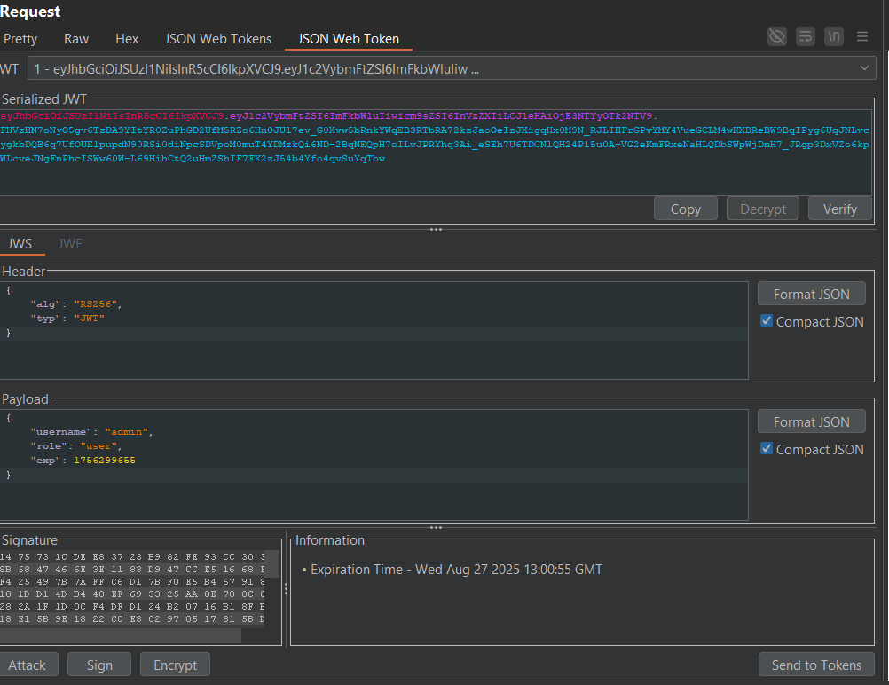

Rõ như ban ngày luôn là JWT .

- Bài này xác định rõ luôn là phải thay đổi role của user để thành admin để lấy được thông tin flag.
- Vào phần editor jwt thì mình thấy thông tin như sau:

Là thuật toán RSA (Thuật toán RSA là một cách băm phần haeder+payload thành phần chữ ký với một khóa public và giải mã bằng một khóa private). Ở đây phải hiểu
là chỉ khi tìm được private key thì mới có khả năng chỉnh sửa được JWT. Và mình có tìm hiểu một số lỗi liên quan đến JWT mà dùng RSA thì có Algorithm confusion attacks. Tức là lầm trình viên sẽ code kiểu như sau:

- Code như này lỗi ác thật , hãy tưởng tượng nếu như tôi đưa thuật toán là HS256 rồi thì dùng public key để truyền vào hàm thì nó cũng hiểu là private key luôn.
- Ý tưởng là vậy giờ thì tìm public key đã:

- Giờ thì làm những thao tác như sau để tấn công:
+Đầu tiền tạo ra một RSA key:
+ Sau đó lấy dạng PEM đi encode thành base64

+ Giờ thì tạo một system key và đưa giá trị đó vào tham số k

+Bây giờ chỉnh sửa jwt thôi
Là xong