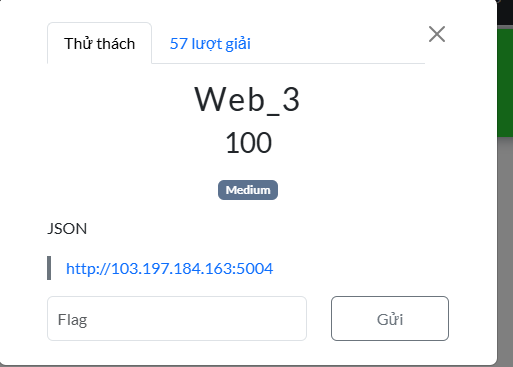
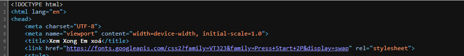
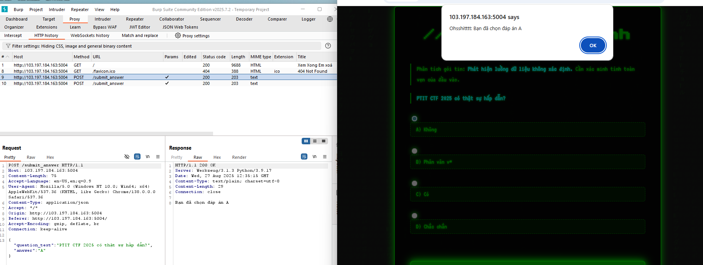
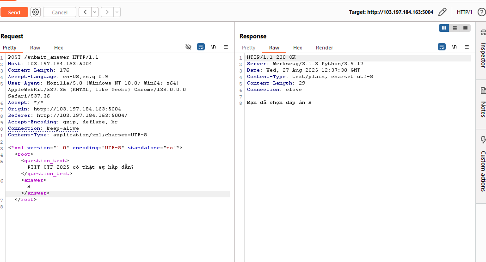
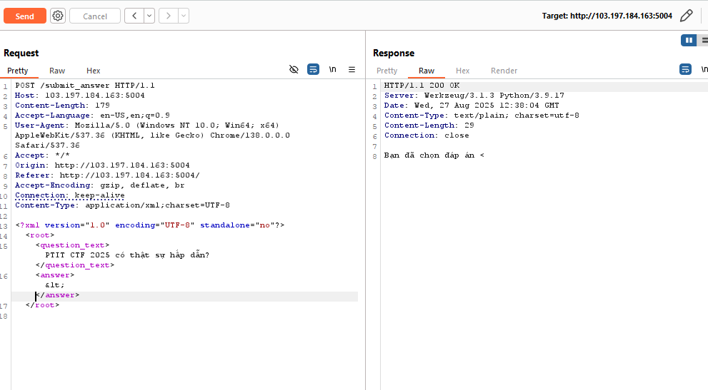
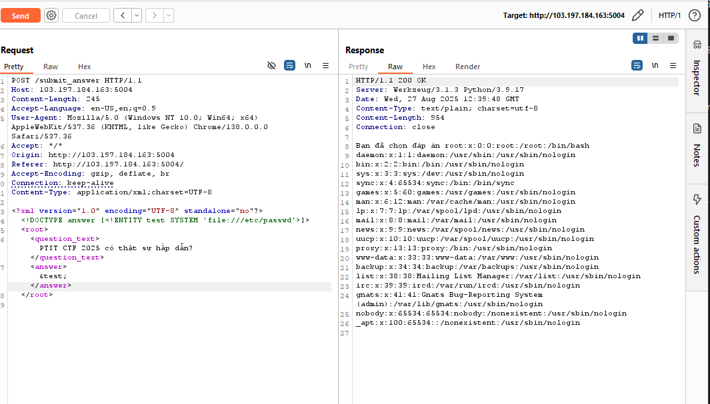
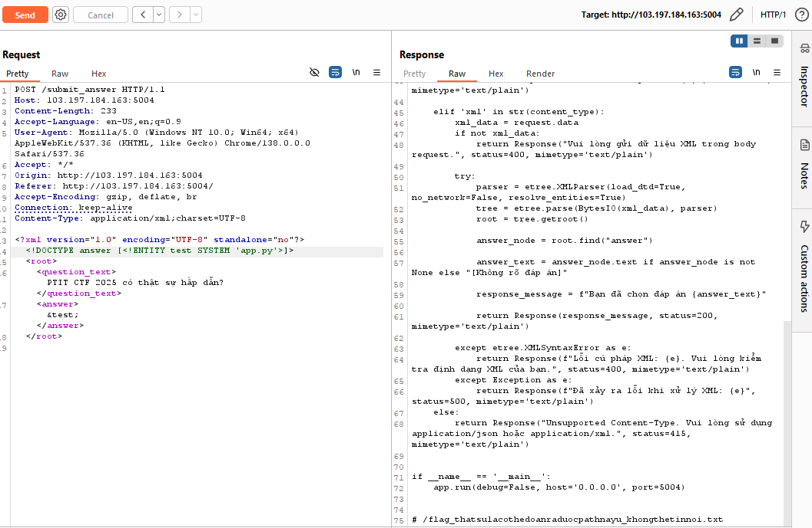
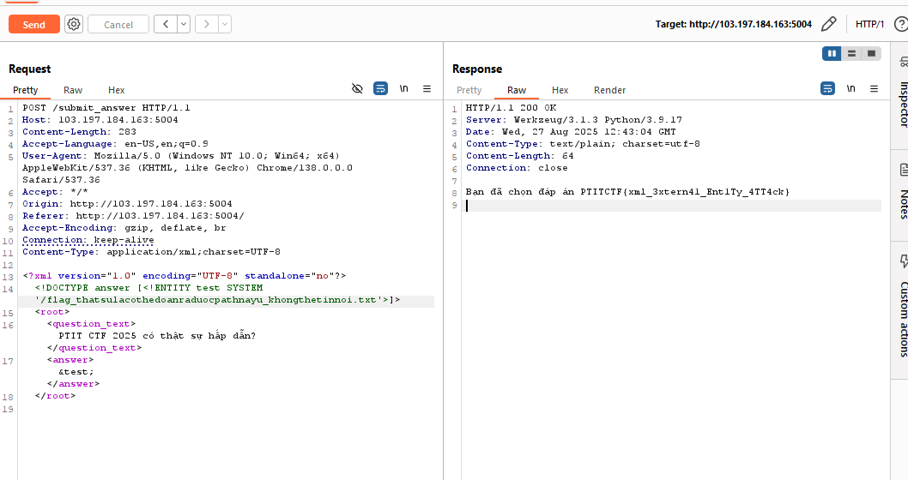

Vào giao diện thử thách thì thấy 

-Mình nhạy cảm nên mình sẽ đoán nó là XXE (Xem xong xóa) bởi vì có JSON nó cũng có xử lí liên quan đến XML
-Hành vi của ứng dụng là khi click chọn đáp án thì nó sẽ gọi một API và hiển thị như sau:

- Mình thử chuyển nó về XML xem sau vì có khi nó cũng xử lí được dưới dạng XML vầ đoán đúng rồi:

-Thử một payload nhỏ của XXE xem nó có hiển thị đúng ko

Vậy có nghĩa là có hiện tượng reflect lại những gì mình ghi vào lấy một payload đọc file trong XXE:

- Rồi luôn file inclusion nữa rồi . Mình cũng phải test một vài cái thư mục nhạy cảm xem có thông tin gì ngon không thôi
nhưng mà một hồi mò thì khó vãi nên tự nhiên mình chợt nhận ra là thường thường mấy cái thử thách CTF hay viết dự án mà hiển thị lên ở file như:
index.php, app.py... nên mình có ý tưởng sẽ thử app.py vì nó viết bằng python (biết được khi dò một số file cấu hình)

-Thấy gì luôn rồi lấy flag thôi

PTITCTF{xml_3xtern41_Ent1Ty_4TT4ck}